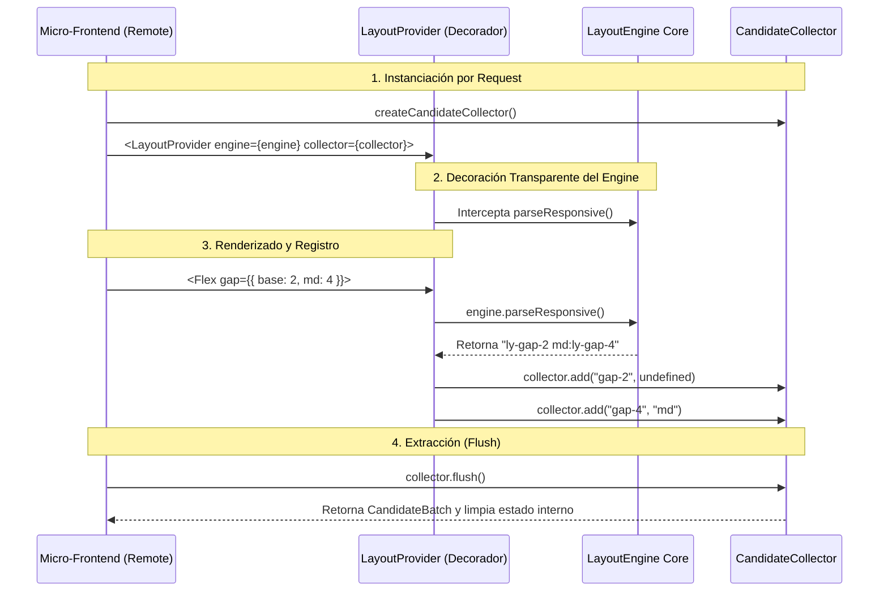

# @ly-sys/layout-protocol

## 📋 Propósito (Purpose)

El paquete `@ly-sys/layout-protocol` define la especificación formal del contrato de comunicación basado en candidatos
utilizado por la suite de diseño para posibilitar la inyección dinámica y la orquestación distribuida de estilos CSS.
Está diseñado especialmente para arquitecturas desacopladas como **Micro-Frontends (MFE)** y renderizado en el
servidor (SSR).

---

## 🏗️ Arquitectura (Architecture)

La arquitectura del protocolo se basa en un recolector de estado con una huella de memoria constante $O(1)$ gracias al
uso de deduplicación en tiempo de ejecución.

### Modelado de Datos (Contracts)

El protocolo define las siguientes estructuras de datos:

- **`CANDIDATE_PROTOCOL_VERSION`**: Versión activa del protocolo (`"1.0"`).
- **`Candidate`**: Representa una clase de utilidad utilizada (ej: `flex-col`, `gap-4`), junto con su breakpoint
  opcional (`sm`, `md`, `lg`). **Nota de diseño**: Las utilidades de los candidatos siempre se registran *sin prefijo* (
  ej: `"flex"` en lugar de `"ly-flex"`).
- **`RawCSS`**: Objeto que divide estilos en línea dinámicos entre estilos síncronos bloqueantes (`critical`) y estilos
  asíncronos (`deferable`).
- **`CandidateBatch`**: Colección deduplicada y agrupada de candidatos y bloques de estilos listos para ser enviados al
  host.
- **`ProviderResponse`**: Payload formal devuelto por un control remoto/MFE hacia la aplicación host.

#### 🎯 Desacoplamiento de Prefijos (Prefix Decoupling)

Para garantizar la máxima portabilidad de los Micro-Frontends, el contrato del protocolo establece que los candidatos
exponen únicamente el nombre base de la utilidad pura (ej: `"gap-4"`).

El prefijo de estilos (como `ly-` o `ly-sys-`) es una configuración de infraestructura que pertenece exclusivamente al
Host. Al inyectar o resolver los estilos:

1. El **Host** concatena dinámicamente su prefijo configurado a la utilidad recibida antes de compilar y emitir el CSS (
   ej: generando `.ly-gap-4 { gap: 16px; }`).
2. El **LayoutProvider** (en los bindings de React) remueve automáticamente los prefijos de las clases de HTML
   interceptadas antes de registrarlas en el colector de candidatos.

De este modo, el mismo Micro-Frontend puede integrarse en diferentes Hosts con distintas configuraciones de prefijos sin
tener que alterar el código del remoto.

### Flujo de Recolección en SSR



---

## ⚙️ Instalación (Installation)

```bash
pnpm add @ly-sys/layout-protocol
```

---

## 📖 Guía de Uso (Usage Guide)

### Creación y Registro de Candidatos en el Micro-Frontend

```typescript
import {createCandidateCollector} from "@ly-sys/layout-protocol";

// 1. Crear el recolector
const collector = createCandidateCollector();

// 2. Registrar utilidades en tiempo de renderizado
collector.add("flex-row");
collector.add("gap-4", "md");

// 3. Registrar CSS crudo generado dinámicamente
collector.addRawCSS({
    critical: ".my-custom-grid { display: grid; }",
    deferable: ".my-custom-grid:hover { opacity: 0.9; }"
});

// 4. Extraer el batch y limpiar el recolector para el siguiente request
const batch = collector.flush();
console.log(batch);
/*
Output:
{
  candidates: [
    { utility: "flex-row" },
    { utility: "gap-4", breakpoint: "md" }
  ],
  rawCSS: {
    critical: ".my-custom-grid { display: grid; }",
    deferable: ".my-custom-grid:hover { opacity: 0.9; }"
  }
}
*/
```

---

## 🔍 Detalles Adicionales (Additional Details)

### Algoritmo de Consolidación e Inyección en el Host (Shell MFE)

Cuando utilizas múltiples Micro-Frontends, la aplicación Shell Host consolida los candidatos de todos los componentes
antes de solicitar el CSS al servicio central de estilos:

```typescript
import {createCandidateCollector, CANDIDATE_PROTOCOL_VERSION} from "@ly-sys/layout-protocol";
import type {ProviderResponse, Candidate} from "@ly-sys/layout-protocol";

async function renderHostPage() {
    const remoteResponses: ProviderResponse[] = [
        {
            protocolVersion: "1.0",
            candidates: [{utility: "flex-col"}],
            rawCSS: {critical: ".header { height: 60px; }"}
        },
        {
            protocolVersion: "1.0",
            candidates: [{utility: "flex-col"}, {utility: "gap-2", breakpoint: "lg"}]
        }
    ];

    // 1. Validar versiones del protocolo
    for (const res of remoteResponses) {
        if (res.protocolVersion !== CANDIDATE_PROTOCOL_VERSION) {
            throw new Error("Versión incompatible del protocolo");
        }
    }

    // 2. Deduplicar globalmente los candidatos de todos los remotos
    const candidateKey = (c: Candidate) => c.breakpoint ? `${c.breakpoint}:${c.utility}` : c.utility;
    const dedupedCandidates = Array.from(
        new Map(
            remoteResponses.flatMap(res => res.candidates).map(c => [candidateKey(c), c])
        ).values()
    );

    console.log(dedupedCandidates);
    // [{ utility: "flex-col" }, { utility: "gap-2", breakpoint: "lg" }]
}
```
